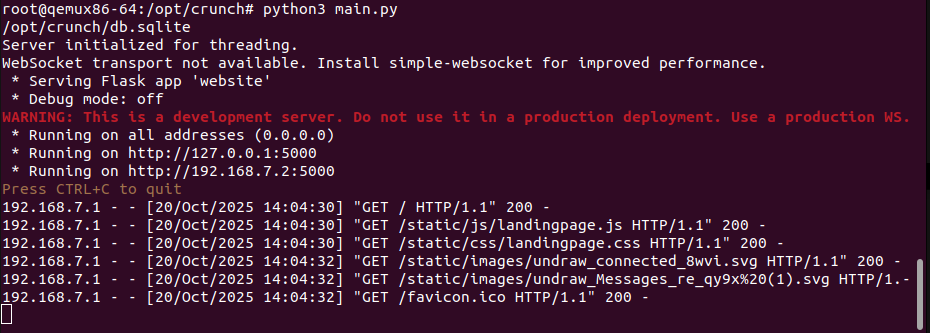
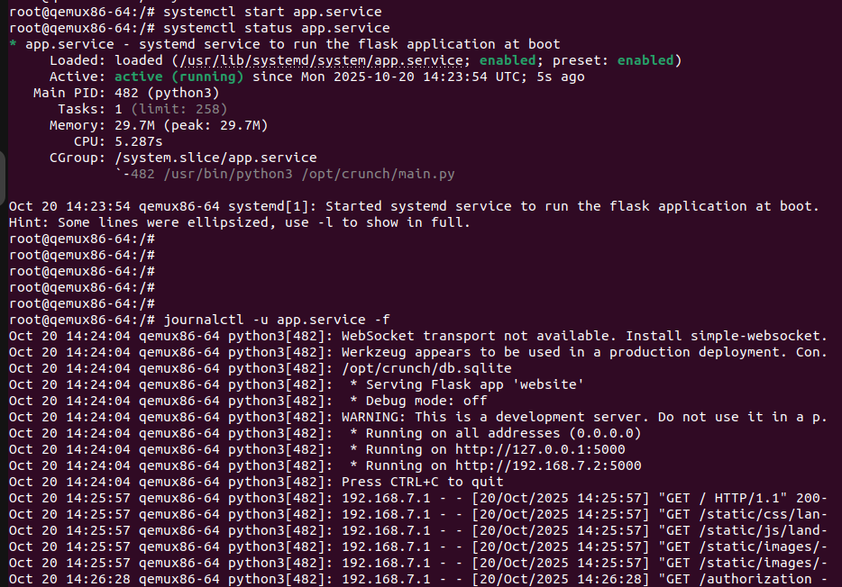
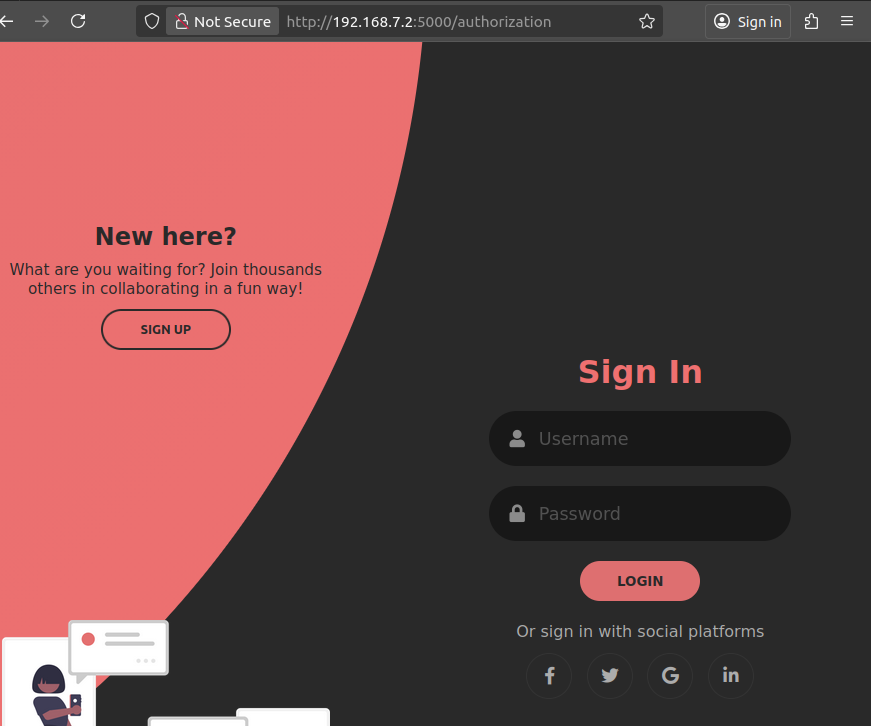
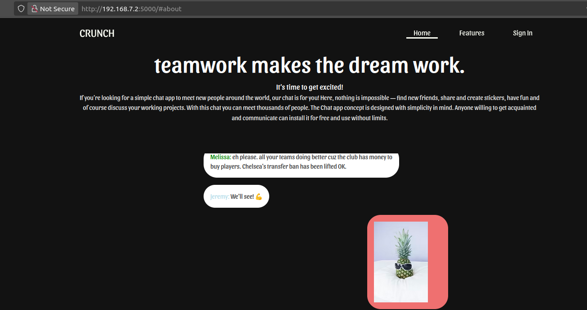

# YOCTO-Project
The project consists of developing a layer for a ***Flask Chat Server application*** .

### Project Goals:
1. Create a new layer  for the crunch project named meta-crunch
2. Create a recipe for crunch named: crunch_git.bb
3. Integrate all python runtime dependencies:

a. Hint: check requirements.txt of the crunch project

4. Create a custom distro to enable systemd
5. Create a systemd service to run the flask application at boot
6. Apply the MIT license of the crunch project
7. Create a custom image based on core-image-minimal to integrate the crunch app
8. Test the application

### Application Repository:
Crunch Application:[crunch](https://github.com/pri1311/crunch#)

###  Python Runtime Dependencies :
- Add them using the variable <code>RDEPENDES</code> 

These dependencies can be generated automatically using pip2bitbake.

### Layer Dependencies:
This layer depends on 
- <code>meta-python</code> 

### Generating Python Packages Automatically with pip2bitbake :
 Steps :
1. Install pip3 on development machine :
  <code>sudo apt-get -y install python-pip</code>
2. Clone the <code>Pip2Bitbake</code> repository :
 
  <code>git clone https://github.com/robseb/PiP2Bitbake.git</code>

3. Run the python script :

  <code> python3 makePipRecipes.py </code>

4. On the script enter the package name and license of the package
 
### Test :
#### Machine:
<code>MACHINE = "qemux86-64"</code>

#### Test Without systemd Service:

Test the Flask application manually using:

  <code>python3 main.py</code>

Then oprn your browser and go to:

### Test with service systemd :

### Application :

#### Useful Resources:

 [Yocto recipe for python application](https://stackoverflow.com/questions/54080551/how-to-install-dependencies-from-requirements-txt-in-a-yocto-recipe-for-a-local)

 [Kas-container with Qemu](https://www.marcusfolkesson.se/blog/kas-container-and-qemu/)

 [pip2bitbake](https://github.com/robseb/PiP2Bitbake)

 [package cloudinary](https://pypi.org/search/?q=cloudinary)

#### Educational Purpose:
- This project is developed for educational purposes within the [Techleef Community](https://github.com/TechLeef)
